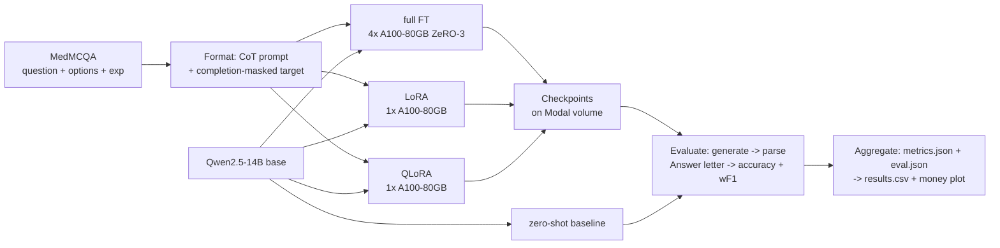
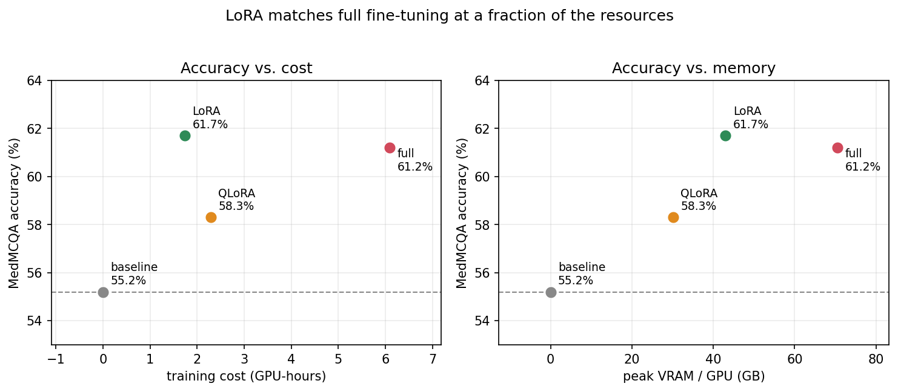

# Full vs. Parameter-Efficient Fine-Tuning of a 14B LLM: A Memory, Speed, Cost, and Accuracy Study on MedMCQA

**AI in Healthcare**

*Author:* Pablo Ruiz Fischer Bennetts · University of Texas at Austin · pablorfb@gmail.com

---

## 1 Introduction

Adapting a general-purpose open large language model (LLM) to a specialized clinical task raises a
practical question: **how much more accurate can the model get by fine-tuning?** and **how does accuracy change across different fine-tuning techniques?** Full fine-tuning of a modern 14-billion-parameter model does not fit on a
single accelerator — its optimizer state alone is larger than an 80 GB GPU — so it forces a
multi-GPU, sharded training setup. Parameter-efficient methods (LoRA, QLoRA) sidestep that by
freezing the base model and training a tiny adapter, collapsing the job back onto a single GPU. The
open question for a practitioner is whether that collapse costs accuracy.

This project runs that comparison directly. I fine-tune **Qwen2.5-14B** on **MedMCQA**, a
medical multiple-choice question-answering benchmark, using three methods — **full fine-tuning**,
**LoRA**, and **QLoRA** — holding everything else fixed, and measure the full
**memory / speed / cost / accuracy** trade-off across them, against a zero-shot baseline.

My objectives were:

- Build a reproducible, instrumented fine-tuning pipeline for a 14B open LLM on a public medical
  Q&A dataset.
- Make the distributed machinery work: run a 14B **full** fine-tune under DeepSpeed ZeRO-3 sharded
  across four GPUs, which is the only way it fits.
- Quantify, under identical data and hyperparameters, how full fine-tuning, LoRA, and QLoRA differ
  in peak GPU memory, training throughput, wall-clock time, dollar cost, and MedMCQA accuracy.
- Report the trade-off, including where parameter-efficient methods match full
  fine-tuning and where fine-tuning fails to beat the untrained baseline.

This is a **controlled** comparison: model, data, sequence length, and effective batch size are held
fixed so that only the fine-tuning *method* varies. The distributed setup is not itself the object of
study; it exists only to make the full-fine-tuning ceiling feasible for comparison.

## 2 Related Work

This work sits between two bodies of prior work — applied medical-QA fine-tuning and the
parameter-efficient-fine-tuning literature — and fills a gap neither fully addresses: a controlled,
resource-instrumented comparison of fine-tuning *methods* on a fixed clinical task.

**Fine-tuning open LLMs for medical Q&A.** Prior work on MedMCQA fine-tunes an open base model —
typically Llama-2-7B with LoRA — and compares it against other *models* (larger open models,
proprietary APIs), reporting accuracy and weighted F1. These studies establish the task framing this
paper reuses (serialize question + options → prompt; predict the answer letter; evaluate on validation
since test labels are withheld) and find that fine-tuning a 7B model mainly improves *task-format
compliance* rather than adding knowledge — in several cases the fine-tuned model does not beat a
majority-class baseline. Their comparison axis is the *model* and their only reported dimension is
*accuracy*. We hold model and data fixed, vary the fine-tuning *method*, and add the *resource*
dimension (memory, throughput, cost) those studies do not measure.

**Parameter-efficient fine-tuning.** LoRA [Hu et al., 2021] freezes the base weights and learns
low-rank updates, cutting trainable parameters by ~3 orders of magnitude; QLoRA [Dettmers et al.,
2023] additionally quantizes the frozen base to 4-bit NF4 so a large model trains on a single
commodity GPU. These methods are typically introduced and validated on *quality* benchmarks — the
standard claim is "near-full-fine-tuning quality at a fraction of the parameters." Less often
reported, especially in an applied medical-QA setting, is a *controlled, side-by-side* comparison of
full fine-tuning, LoRA, and QLoRA on one task under identical data, sequence length, and effective
batch size, with the memory, speed, and cost each method actually incurs measured directly. That
controlled comparison is this paper's contribution.

## 3 Methodology

Figure 1 shows the overall workflow: format MedMCQA into supervised prompts, fine-tune Qwen2.5-14B
three ways on a serverless GPU platform, save each checkpoint, evaluate all checkpoints (plus the
untrained baseline) on the held-out set, and aggregate into a single results table and plot.

*Figure 1. End-to-end workflow. The three training branches differ only in method and the GPU count
each requires; everything upstream and downstream is shared.*

### 3.1 Dataset

I use **MedMCQA** (`openlifescienceai/medmcqa`), a 4-way multiple-choice medical exam Q&A dataset
(~183k train / 4.2k validation / 6.2k test). Each row contains the question text, four options
(`opa`–`opd`), the correct-option index `cop` (0–3 → A–D), a free-text explanation `exp`, and a
`subject_name`. Because the official **test labels are withheld**, I follow standard practice for this
dataset and treat the **validation split as the test set**; the real test set is ignored.

For training I sample **10,000 examples** (seeded shuffle) from the train split and train for **3
epochs**. Evaluation is on the validation split (the zero-shot baseline reported here uses a
1,000-example subset; the final evaluation uses the full split).

### 3.2 Prompt and target formatting

Each example is serialized into a fixed instruction prompt containing the question and the four
lettered options, ending in a cue to reason and then answer. The **training target is
chain-of-thought (CoT)**: the model is trained on the dataset's `exp` explanation followed by a final
`Answer: <letter>` line. Loss is computed **only on the completion** (the prompt tokens are masked
with `-100`), and the reasoning is truncated if needed so that the final answer letter always
survives within the 512-token sequence limit.

The CoT target is a deliberate design choice. A single-letter target teaches only output *format*,
which a capable base model already knows; training on the explanation gives a real learning signal and
is the change most likely to let fine-tuning exceed the zero-shot baseline.

### 3.3 Fine-tuning methods

All three methods share identical data, sequence length, effective batch size, epoch count, and
random seed. They differ only in what is trained and, consequently, in the hardware each requires
(Table 1).

- **Full fine-tuning** — all ~14.8B parameters are trainable, in bf16, under DeepSpeed ZeRO-3.
- **LoRA** — the base model stays frozen in bf16; low-rank adapters (rank 16, α 32) are attached to
  the attention projections (`q,k,v,o_proj`).
- **QLoRA** — identical to LoRA, but the frozen base is loaded in 4-bit NF4 with double quantization,
  and only the adapters are trained.

### 3.4 Distributed training setup

**Full fine-tuning requires the multi-GPU node; the PEFT methods do not**. A 14B full fine-tune's memory footprint is dominated not by the 28 GB of
bf16 weights but by the optimizer state: Adam keeps fp32 master weights plus two moments (~16
bytes/parameter), so the full training footprint is ≈225 GB, far beyond one 80 GB GPU. **DeepSpeed
ZeRO-3** shards parameters, gradients, and optimizer state across the four GPUs, making it fit. Checkpoints are consolidated on save via
`stage3_gather_16bit_weights_on_model_save`.

LoRA and QLoRA freeze the base, so gradients and optimizer state exist only for the ~25M adapter
parameters. Each job runs on a **single** GPU. The GPU
*type* is held fixed at A100-80GB across all three runs so that throughput comparisons are not
confounded by hardware; QLoRA's measured memory is what demonstrates it would also fit on a far smaller GPU.

### 3.5 Instrumentation and metrics

A custom benchmarking callback captures:

- **Trainable and total parameters.**
- **Steady-state throughput (tokens/s).** For multi-GPU runs, token counts are summed across
  ranks.
- **Peak GPU memory**: `max_memory_allocated`/`max_memory_reserved` per rank, reduced across ranks
  with `all_reduce(MAX)`.
- **Wall-clock runtime:** world size (GPU count), and derived **GPU-hours** and **dollar cost**.

### 3.6 Experimental setup

**Table 1. Fixed vs. varied factors.** Everything except the method (and the GPU count it forces) is
held constant.

| Factor | Value |
|---|---|
| Base model | Qwen2.5-14B (Apache-2.0) |
| Dataset / task | MedMCQA, 4-way MCQA; validation split used as test |
| Train size / epochs | 10,000 examples × 3 epochs |
| Max sequence length | 512 |
| Global batch size | 64  |
| Target | Explanation + one letter answer |
| Precision | bf16 (QLoRA base: 4-bit NF4, double-quant) |
| LoRA config | rank 16, α 32, dropout 0.05, targets `q,k,v,o_proj` |
| Learning rate | 1e-5 (full), 2e-4 (LoRA/QLoRA) |
| **Method (varied)** | **full · LoRA · QLoRA** |
| **GPUs (consequence)** | **4× A100-80GB (full) · 1× A100-80GB (LoRA, QLoRA)** |

The global batch of 64 is held constant by adjusting per-device batch size and gradient accumulation
per method (full: 2×8×4 GPUs; LoRA/QLoRA: 8×8×1 GPU).

### 3.7 Evaluation protocol

Each model (the three fine-tuned checkpoints plus the untrained base as zero-shot baseline) is
evaluated identically: the CoT prompt is fed in, up to 256 tokens are generated greedily, and the
predicted answer is parsed as the letter following the final `Answer:` in the output (reasoning
text contains incidental A/B/C/D mentions, so the final answer, not the first letter, is taken).
Unparseable outputs are counted and scored as incorrect. Metrics are **accuracy** and **weighted
F1** over the four classes. The baseline is run through the exact same path, so any difference is
attributable to fine-tuning, not to evaluation differences.

## 4 Results

### 4.1 Resource comparison

**Table 2. Per-method training resources** (Qwen2.5-14B, 10k×3 epochs, global batch 64, A100-80GB). Throughput is aggregate across the run's GPUs; peak VRAM is per GPU.

| Method | GPUs | Trainable params | Peak VRAM (alloc / resv) | Throughput | Wall-clock | GPU-hours |
|---|---|---|---|---|---|---|
| **full** | 4 | 14.77 B (100%) | 70.5 / 82.6 GB | 1125 tok/s | 91.3 min | 6.09 |
| **LoRA** | 1 | 25.2 M (0.17%) | 43.0 / 63.5 GB | 981 tok/s | 104.7 min | 1.74 |
| **QLoRA** | 1 | 25.2 M (0.31%\*) | 30.1 / 51.8 GB | 747 tok/s | 137.6 min | 2.29 |

\* QLoRA's percentage is against its 4-bit-*packed* base (≈8.2 B counted units), not 14 B, so it is
not directly comparable to LoRA's; A closer comparison is the **absolute** trainable count,
which is identical for LoRA and QLoRA (25.2 M).

Three findings stand out even before accuracy:

1. **Memory collapses across methods:** peak VRAM drops 70.5 → 43.0 → 30.1 GB (full → LoRA → QLoRA). The full fine-tune needs the whole
   80 GB node; both PEFT methods fit on one card, and QLoRA's 30 GB peak shows it would run on a
   commodity 40 GB (or, at reduced batch, 24 GB) GPU.
2. **Trainable parameters drop ~600×** (14.77 B → 25.2 M), which is the mechanism behind the memory
   savings: it is the *trainable* set, not the weight count, that drives optimizer/gradient memory.
3. **QLoRA is not the cheapest in time or dollars, despite the lowest memory.** Its 4-bit
   dequantization overhead makes it ~25% slower per GPU than LoRA (747 vs 981 tok/s), so it takes the
   **most** wall-clock and GPU-hours of the two single-GPU methods. Memory savings and cost savings
   are not the same axis, good insight to keep in mind when running in production.

Dollar cost follows GPU-hours directly (cost = GPU-hours × per-GPU rate), so on this hardware the
ordering is **LoRA (1.74) < QLoRA (2.29) < full (6.09 GPU-hours)** — full fine-tuning costs ~3.5× LoRA.

### 4.2 Accuracy comparison

**Table 3. MedMCQA accuracy** (1,000-example validation).

| Model | Accuracy | Weighted F1 | Unparseable |
|---|---|---|---|
| Zero-shot baseline (Qwen2.5-14B, untrained) | 55.2% | 0.552 | 0 / 1000 |
| **full** (fine-tuned) | **61.2%** | 0.611 | 0 / 1000 |
| **LoRA** (fine-tuned) | **61.7%** | 0.617 | 0 / 1000 |
| **QLoRA** (fine-tuned) | **58.3%** | 0.583 | 0 / 1000 |

Every model parses cleanly (0 unparseable of 1000), confirming the CoT generate-and-parse path is
reliable. All three fine-tuning methods **improve the 55.2% zero-shot bar**: full by +6.0, LoRA by
+6.5, QLoRA by +3.1. The two central comparisons are immediate: **LoRA (61.7%) matches full
fine-tuning (61.2%)**, while
**QLoRA (58.3%) trails both by ~3 points**.

### 4.3 Accuracy–resource trade-off (money plot)

Figure 2 plots accuracy against training cost (GPU-hours) and against peak VRAM, one point per method
plus the baseline. The zero-shot baseline sits at 55.2% with
zero training cost; **full fine-tuning reaches 61.2% at 6.09 GPU-hours**; **LoRA reaches 61.7% at 1.74
GPU-hours**; and **QLoRA reaches 58.3% at 2.29 GPU-hours**. LoRA strikes the best balance, it
**matches full fine-tuning's accuracy at ~3.5× less compute and on a single GPU**. Full
FT buys no accuracy over LoRA for its far larger footprint, and QLoRA trades ~3 points of accuracy and
*more* compute time than LoRA for its lower peak memory.

*Figure 2. Accuracy vs. resources. LoRA (green) and full fine-tuning (red) reach the same accuracy,
but LoRA sits far to the left on both cost and memory; QLoRA (orange) trades ~3 points for lower
memory; the dashed line is the untrained baseline.*

### 4.4 Discussion

The evaluated results answer all three motivating questions:

**(i) Does fine-tuning beat the zero-shot baseline?** Yes, clearly. All three methods exceed the 55.2%
untrained baseline — full by **+6.0** (61.2%), LoRA by **+6.5** (61.7%), QLoRA by **+3.1** (58.3%).
Unlike prior 7B work on this task, where fine-tuning mostly reinforced output format without adding
capability, the chain-of-thought target here produces a clear accuracy gain.

**(ii) Does 4-bit quantization cost accuracy?** Yes — and this is the sharpest finding. QLoRA trails
full-precision LoRA by **3.4 points** (58.3% vs 61.7%) despite an identical adapter and training
recipe; the only difference is the 4-bit NF4 base. Combined with the resource results, QLoRA is
strictly dominated by LoRA on this hardware: it is **less accurate, slower, and costs more GPU-hours**,
buying only a lower peak-memory footprint. QLoRA is therefore the right choice *only* when memory is
the binding constraint (e.g., a GPU that cannot hold LoRA's ~43 GB), not as a default.

**(iii) Does LoRA match the full fine-tuning ceiling?** **Yes.** LoRA's 61.7% is statistically
indistinguishable from full fine-tuning's 61.2% (a 0.5-point gap on 1,000 examples, inside the ±3%
sampling noise), while training **0.17% of the parameters on one GPU instead of all 14.8 B across
four**, in **~3.5× fewer GPU-hours** and **~40% less peak memory**. This is the paper's central
result: for adapting this 14B model to MedMCQA, full fine-tuning buys **no measurable accuracy** over
LoRA for its far larger resource cost. 

## 5 Conclusion

Three conclusions from our study. First, chain-of-thought fine-tuning **beats the 55.2%
zero-shot baseline** across the board (full 61.2%, LoRA 61.7%, QLoRA 58.3%). Second, and most relevant, **LoRA matches full fine-tuning** (61.7% vs 61.2%, within noise) while training 0.17% of the
parameters on **on a single GPU instead of four**, in **~3.5× fewer GPU-hours**: full fine-tuning buys no
measurable accuracy for its far larger cost on this task. Third, **4-bit quantization costs a significant ~3
points** (QLoRA vs LoRA) and, because of its dequantization overhead, QLoRA is also *slower* and
*pricier* than LoRA, only scenario in which is a better option is when memory is the hard constraint. Taken
together: for adapting a 14B model to this task, **LoRA is the best choice**, matching the full-FT
ceiling at a fraction of the resources.

**Limitations.** Training is capped at 10k examples × 3 epochs for cost reasons, well below the full
183k train set. Accuracy is scored by
letter-parsing greedy generations; log-likelihood scoring would be more robust for the base model.

**Future work.** The most direct open question is whether full fine-tuning would pull *ahead* of LoRA
with more training data: full FT has ~600× the trainable capacity, so its equal accuracy at 10k
examples may reflect a shared task ceiling or simply too little data to exercise that capacity. Additionally, worth sweeping LoRA ranks and report the per subject accuracy to focus on those areas.

## References

- Rajbhandari, S., Rasley, J., Ruwase, O., He, Y. (2020). *ZeRO: Memory Optimizations Toward Training
  Trillion Parameter Models.* SC20.
- Hu, E. J., et al. (2021). *LoRA: Low-Rank Adaptation of Large Language Models.* arXiv:2106.09685.
- Dettmers, T., Pagnoni, A., Holtzman, A., Zettlemoyer, L. (2023). *QLoRA: Efficient Finetuning of
  Quantized LLMs.* arXiv:2305.14314.
- Pal, A., Umapathi, L. K., Sankarasubbu, M. (2022). *MedMCQA: A Large-scale Multi-Subject
  Multi-Choice Dataset for Medical Domain Question Answering.* CHIL.
- Qwen Team (2024). *Qwen2.5 Technical Report.* arXiv:2412.15115.
